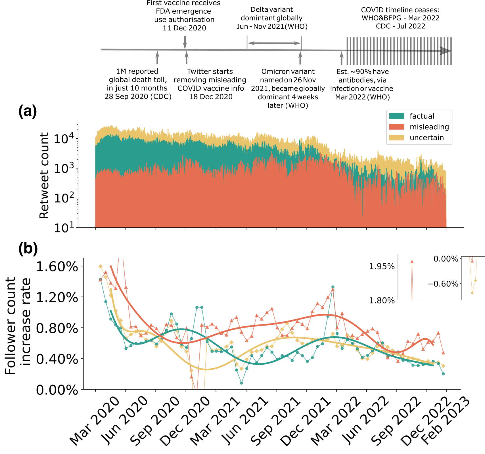

# COVID_Retweets
This repo documents the programming code used in our manuscript "[Measuring the co-evolution of online engagement with (mis)information and its visibility at scale](https://arxiv.org/pdf/2506.06106)", authored by Yueting Han, Paolo Turrini, Marya Bazzi, Giulia Andrighetto, Eugenia Polizzi, and Manlio De
Domenico (Preprint, 2025). 

The dataset used in this study cannot be made publicly available due to privacy regulations. 
However, we provide the tweet IDs of the collected data, allowing anyone to retrieve the tweets directly via Twitter's API. 
Alternatively, the full dataset can be obtained from the corresponding authors (Yueting Han & Manlio De Domenico) upon reasonable request.

<br/>

## Dataset

In this paper, we measure the co-evolution of online "engagement" with (mis)information and its "visibility", where engagement corresponds to user interactions on social media, and visibility to fluctuations in user
follower counts.

Our investigation into the co-evolution of interactions and follower growth is anchored on a Twitter (now "X") dataset that contains around 113.7 million retweets, collected second-by-second from 17 March 2020 to 12 February 2023, across countries with all content in English. These retweets are identified as being related to COVID-19, and each is classified into one of three types: factual (36.9%), misleading (7.7%) and uncertain (55.4%). Approximately 13.9 million users are involved, either retweeting or being retweeted, with an estimated total follower count of 28.3 billion at the start (17 March 2020) and 32.4 billion at the end (12 February 2023) of the dataset.

The raw data is collected by the [COVID-19 Infodemic Observatory](https://covid19obs.fbk.eu), following the approaches used in previous studies but over an extended timespan: [Gallotti et al.](https://www.nature.com/articles/s41562-020-00994-6) (January - March 2020), [Castioni et al.](https://royalsocietypublishing.org/doi/full/10.1098/rsos.220716) (January - May 2020).
Those studies explore alternative aspects using less granular metadata. 
Some necessary data processing is performed in this work to enable relevant modelling. 

<figure style="text-align: center;">
  
  <figcaption><strong>Figure 3: Retweet vs follower count variations by category.</strong> We track variations in follower counts for each campaign (factual, misleading, uncertain), in contrast to their daily retweet counts. The timeline above presents COVID-related events that can be relevant to these fluctuations.</figcaption>
</figure>

<br/>

## Repo Structure

```bash
COVID_Retweets    
¦  README.md   
¦  requirements.txt
¦  graph_demo.ipynb                             # instructions: import & extract temporal (sub)graphs
¦
¦  1_graph_filter_vs_unfiltered.ipynb           # Fig 1 in paper
¦  2_retweets_vs_followers.ipynb                # Fig 2 & 3
¦  3.1_epiSim_1month.ipynb                      # Fig 4a
¦  3.2_epiSim_3month.ipynb                      # Fig 4b
¦  3.3_epiSim_6month.ipynb                      # Fig 4c
¦  3.4_epiSim_para.ipynb                        # Fig 4d
¦
¦  SM1_dataCleaning.ipynb                       # process raw data
¦  SM2_graphGen.ipynb                           # generate graphs from raw data
¦  SM3_dispFilter.ipynb                         # SM figures
¦
+--- data (only tweet IDs publicly available)
¦   ¦  covid19_infodemic_RT_en.dat              # raw data
¦   ¦  dataCleaning_indexRetain.pickle  
¦   ¦  tweetID_clean.zip                        # tweetID .csv (compressed)  
¦   ¦                                       
¦   +--- mappingID                              # encode characters into integers (to save computation resources)
¦   ¦   ¦  newsCateogry_dict_decode.pickle
¦   ¦   ¦  newsCateogry_dict_generalised_code.pickle
¦   ¦   ¦  user_dict_decode.pickle
¦   ¦
¦   +--- graphs                                     
¦       ¦  G_origial.gpickle
¦       ¦  G_origial_unattributed.gpickle       # an unattributed version for faster loading
¦       ¦  G_filtered.gpickle                   # attributed filtered network
¦
+--- figures
¦   ¦  ... 
¦
+--- results (not publicly available)           # store some time-consuming results
¦   ¦  ...

```


